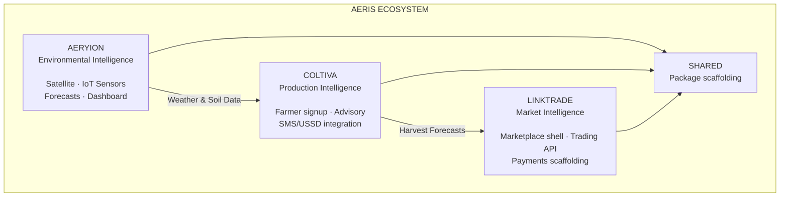

# AERIS Group - Integrated Agricultural Intelligence Infrastructure

[](https://github.com/aeris-group/aeris-monorepo/actions/workflows/ci.yml)

## Ecosystem Architecture

AERIS is a three-platform agricultural intelligence ecosystem designed for Uganda's Lango sub-region. The codebase is organized as independent product apps and services, with shared package scaffolding for future cross-service models, events, DB helpers, and utilities.



## Repository Structure

```text
aeris-monorepo/
├── .github/workflows/ci.yml
├── aeris-website/          Next.js corporate site :3004
├── aeryion/
│   ├── backend/            FastAPI :8000
│   └── dashboard/          Next.js :3001
├── coltiva/
│   ├── backend/            FastAPI :8001
│   ├── dashboard/          Next.js authenticated app :3003
│   └── website/            Next.js public site/auth flow :3002
├── linktrade/
│   ├── backend/            FastAPI :8002
│   └── web/                Next.js :3000
├── shared/                 Python package scaffolding
├── scripts/                Data loading scripts
├── docker-compose.yml      Local infra plus partial app services
├── pnpm-workspace.yaml
├── package.json
└── README.md
```

## Prerequisites

| Tool | Version | Purpose |
|------|---------|---------|
| Node.js | >= 20.x | Next.js apps |
| pnpm | >= 9.x | Workspace package manager |
| Python | >= 3.11 | FastAPI backends |
| Docker | Latest | Local PostgreSQL/PostGIS and Redis |

## Setup

### 1. Install frontend dependencies

```bash
pnpm install
```

### 2. Create environment files

Only these env example files currently exist:

```bash
cp aeris-website/.env.local.example aeris-website/.env.local
cp coltiva/website/.env.local.example coltiva/website/.env.local
cp coltiva/dashboard/.env.local.example coltiva/dashboard/.env.local
cp coltiva/backend/.env.example coltiva/backend/.env
cp linktrade/backend/.env.example linktrade/backend/.env
```

Aeryion does not currently have checked-in env examples. For local backend work, create `aeryion/backend/.env` manually with at least:

```dotenv
SUPABASE_URL=
SUPABASE_SERVICE_KEY=
GCS_BUCKET_NAME=
SENTRY_DSN=
JWT_SECRET=dev-secret-change-in-production
NASA_FIRMS_MAP_KEY=
```

For the Aeryion dashboard, set `NEXT_PUBLIC_AERYION_API_URL` only when you need to point the rewrite at a non-local backend. It defaults to `http://localhost:8000`.

For LinkTrade web, set `NEXT_PUBLIC_LINKTRADE_API_URL` only when you need a non-local backend. It defaults to `http://localhost:8002`.

### 3. Start local infrastructure

```bash
docker compose up postgres redis -d
```

The compose file currently references app services too, but only `linktrade/backend`, `linktrade/web`, and `aeryion/dashboard` have Dockerfiles checked in. Until the missing Aeryion and Coltiva backend Dockerfiles are added, use Docker Compose for infrastructure and run the app processes directly.

### 4. Run Python backends

Use a separate virtual environment per backend, or reuse a local project venv if you already have one.

```bash
cd aeryion/backend
python3 -m venv venv
source venv/bin/activate
pip install -r requirements.txt
uvicorn app.main:app --reload --port 8000
```

```bash
cd coltiva/backend
python3 -m venv venv
source venv/bin/activate
pip install -r requirements.txt
uvicorn app.main:app --reload --port 8001
```

```bash
cd linktrade/backend
python3 -m venv venv
source venv/bin/activate
pip install -r requirements.txt
uvicorn app.main:app --reload --port 8002
```

### 5. Run frontend apps

From the repo root:

```bash
pnpm dev:linktrade             # http://localhost:3000
pnpm dev:dashboard             # Aeryion dashboard, http://localhost:3001
pnpm dev:website               # Coltiva website, http://localhost:3002
pnpm dev:dashboard-coltiva     # Coltiva dashboard, http://localhost:3003
pnpm dev:aeris-website         # Corporate website, http://localhost:3004
```

`pnpm dev:all` runs every workspace app in parallel.

### 6. Verify connectivity

Backend health paths:

```bash
curl http://localhost:8000/health
curl http://localhost:8001/api/v1/health
curl http://localhost:8002/api/v1/health
```

Frontend health paths:

```bash
curl http://localhost:3000/api/health
curl http://localhost:3001/api/health
```

## Checks

Frontend checks:

```bash
pnpm -r lint
pnpm -r type-check
```

Backend smoke tests, from each package directory:

```bash
cd aeryion/backend && pytest tests -q
cd coltiva/backend && pytest tests -q
cd linktrade/backend && pytest tests -q
cd shared && pytest tests -q
```

## Service URLs

| Service | Local URL |
|---------|-----------|
| LinkTrade Web | http://localhost:3000 |
| Aeryion Dashboard | http://localhost:3001 |
| Coltiva Website | http://localhost:3002 |
| Coltiva Dashboard | http://localhost:3003 |
| AERIS Website | http://localhost:3004 |
| Aeryion API docs | http://localhost:8000/docs |
| Coltiva API docs | http://localhost:8001/docs |
| LinkTrade API docs | http://localhost:8002/docs |
| PostgreSQL/PostGIS | localhost:5432 |
| Redis | localhost:6379 |

## Deployment

### Frontends on Vercel

Each frontend should be deployed as its own Vercel project with the matching root directory:

| App | Root directory | Main env vars |
|-----|----------------|---------------|
| LinkTrade Web | `linktrade/web` | `NEXT_PUBLIC_LINKTRADE_API_URL` |
| Aeryion Dashboard | `aeryion/dashboard` | `NEXT_PUBLIC_AERYION_API_URL` |
| Coltiva Website | `coltiva/website` | See `coltiva/website/.env.local.example` |
| Coltiva Dashboard | `coltiva/dashboard` | See `coltiva/dashboard/.env.local.example` |
| AERIS Website | `aeris-website` | See `aeris-website/.env.local.example` |

API rewrites are configured in each app's `next.config.ts`.

### Backends

- `aeryion/backend` and `coltiva/backend` include `railway.json` and `Procfile` deployment config.
- `linktrade/backend` includes a Dockerfile and Procfile.
- The root `docker-compose.yml` is currently best used for local infrastructure until missing backend Dockerfiles are added.
