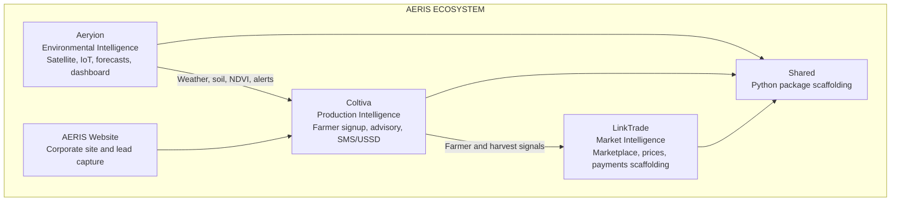

# AERIS Group - Integrated Agricultural Intelligence Infrastructure

[](https://github.com/aeris-agro/aeris-monorepo/actions/workflows/ci.yml)

AERIS is a multi-product agricultural intelligence ecosystem for Uganda's Lango sub-region. The repository combines environmental intelligence, farmer production advisory, market/trading services, and public web experiences in one monorepo.

At a high level:

```text
Aeryion      Environmental intelligence
Coltiva      Farmer production and advisory intelligence
LinkTrade    Market and trading intelligence
AERIS site   Corporate/public website
shared       Shared Python package scaffolding
```

## Architecture



## Repository Layout

```text
aeris-monorepo/
├── .github/workflows/ci.yml     GitHub Actions CI
├── .nvmrc                       Node version for CI/nvm
├── mise.toml                    Node version for mise users
├── aeris-website/               Next.js corporate site :3004
├── aeryion/
│   ├── backend/                 FastAPI environmental API :8000
│   └── dashboard/               Next.js dashboard :3001
├── coltiva/
│   ├── backend/                 FastAPI farmer/advisory API :8001
│   ├── dashboard/               Next.js authenticated app :3003
│   └── website/                 Next.js public site/auth flow :3002
├── linktrade/
│   ├── backend/                 FastAPI market/trading API :8002
│   └── web/                     Next.js web app :3000
├── shared/                      Python package scaffolding
├── scripts/                     Data loading scripts
├── docker-compose.yml           Local infra plus partial app services
├── package.json                 Root PNPM scripts
├── pnpm-workspace.yaml          Frontend workspace definition
└── README.md
```

## Product Areas

### Aeryion

Aeryion is the environmental intelligence product. It serves weather, rainfall, NDVI, soil, fire, forecast, station, and alert data.

Backend:

```text
aeryion/backend
```

Main FastAPI entry point:

```text
aeryion/backend/app/main.py
```

Primary routes:

```text
/health
/v1/ndvi
/v1/rainfall
/v1/soil
/v1/alerts
/v1/forecast
/v1/fire
/v1/stations
```

Configuration lives in:

```text
aeryion/backend/app/config.py
```

Expected backend environment variables include:

```dotenv
SUPABASE_URL=
SUPABASE_SERVICE_KEY=
GCS_BUCKET_NAME=
SENTRY_DSN=
JWT_SECRET=dev-secret-change-in-production
NASA_FIRMS_MAP_KEY=
```

Workers live under:

```text
aeryion/backend/workers
```

They cover data ingestion, Sentinel-2 NDVI, CHIRPS rainfall, alert generation, and demo alert seeding. Some workers use Google Earth Engine and Google Cloud Storage.

Dashboard:

```text
aeryion/dashboard
```

The dashboard is a Next.js app on port `3001`. Its `next.config.ts` rewrites `/api/v1/*` requests to the Aeryion backend.

### Coltiva

Coltiva is the farmer production and advisory platform. It handles farmer registration, authentication, planting guidance, pest reports, recommendations, agents, SMS, and USSD flows.

Backend:

```text
coltiva/backend
```

Main FastAPI entry point:

```text
coltiva/backend/app/main.py
```

Primary route groups:

```text
/api/v1/health
/api/v1/auth
/api/v1/farmers
/api/v1/planting
/api/v1/pest-reports
/api/v1/recommendations
/api/v1/agents
/api/v1/ussd
```

Important modules:

```text
coltiva/backend/app/routers/auth.py
coltiva/backend/app/routers/planting.py
coltiva/backend/app/services/sms.py
coltiva/backend/app/clients/aeryion.py
```

Coltiva integrates with:

- Supabase
- Africa's Talking SMS
- Aeryion API
- LinkTrade API
- Upstash Kafka/Redis scaffolding

Frontend apps:

```text
coltiva/website      Public site and auth flow :3002
coltiva/dashboard    Authenticated dashboard :3003
```

Both apps rewrite `/api/v1/*` requests to the Coltiva backend.

### LinkTrade

LinkTrade is the market and trading platform. It provides marketplace and trading API scaffolding for listings, orders, contracts, buyers, disputes, quality, transport, and prices.

Backend:

```text
linktrade/backend
```

Main FastAPI entry point:

```text
linktrade/backend/app/main.py
```

Primary route groups:

```text
/api/v1/health
/api/v1/listings
/api/v1/orders
/api/v1/contracts
/api/v1/prices
/api/v1/buyers
/api/v1/quality
/api/v1/transport
/api/v1/disputes
```

LinkTrade has scaffolding for:

- Supabase
- MTN MoMo
- Airtel Money
- Kafka
- Aeryion and Coltiva API integration
- WFP VAM price data

Frontend:

```text
linktrade/web
```

The web app runs on port `3000` and rewrites `/api/v1/*` requests to the LinkTrade backend.

### AERIS Website

The corporate/public AERIS website lives in:

```text
aeris-website
```

It runs on port `3004` and includes lead capture/KYC API scaffolding under:

```text
aeris-website/src/app/api/kyc/lead
```

### Shared Package

The shared Python package lives in:

```text
shared
```

Current package areas:

```text
shared/db
shared/events
shared/models
shared/utils
```

This package is mostly scaffolding today. It is intended for future cross-service models, event contracts, database helpers, and utilities.

## Tooling

| Tool | Version | Purpose |
|------|---------|---------|
| Node.js | 20.x | Next.js apps and frontend CI |
| pnpm | 10.26.1 | Frontend workspace package manager |
| Python | >= 3.11 | FastAPI backends |
| Docker | Latest | Local PostgreSQL/PostGIS and Redis |

Node version is declared in:

```text
.nvmrc
mise.toml
```

Use one of these locally:

```bash
nvm install
nvm use
```

or:

```bash
mise install
mise trust
```

Then enable the pinned PNPM version:

```bash
corepack enable
corepack prepare pnpm@10.26.1 --activate
```

## Setup

### 1. Install Frontend Dependencies

From the repo root:

```bash
pnpm install
```

### 2. Create Environment Files

Checked-in env examples currently exist for:

```bash
cp aeris-website/.env.local.example aeris-website/.env.local
cp coltiva/website/.env.local.example coltiva/website/.env.local
cp coltiva/dashboard/.env.local.example coltiva/dashboard/.env.local
cp coltiva/backend/.env.example coltiva/backend/.env
cp linktrade/backend/.env.example linktrade/backend/.env
```

Aeryion does not currently have a checked-in env example. Create `aeryion/backend/.env` manually with at least:

```dotenv
SUPABASE_URL=
SUPABASE_SERVICE_KEY=
GCS_BUCKET_NAME=
SENTRY_DSN=
JWT_SECRET=dev-secret-change-in-production
NASA_FIRMS_MAP_KEY=
```

Optional frontend API variables:

```dotenv
NEXT_PUBLIC_AERYION_API_URL=http://localhost:8000
NEXT_PUBLIC_COLTIVA_API_URL=http://localhost:8001
NEXT_PUBLIC_LINKTRADE_API_URL=http://localhost:8002
```

### 3. Start Local Infrastructure

```bash
docker compose up postgres redis -d
```

The compose file currently references app services too, but only `linktrade/backend`, `linktrade/web`, and `aeryion/dashboard` have Dockerfiles checked in. Until the missing Aeryion and Coltiva backend Dockerfiles are added, use Docker Compose for infrastructure and run app processes directly.

### 4. Run Python Backends

Use a separate virtual environment per backend, or reuse a local project venv.

Aeryion:

```bash
cd aeryion/backend
python3 -m venv venv
source venv/bin/activate
pip install -r requirements.txt
uvicorn app.main:app --reload --port 8000
```

Coltiva:

```bash
cd coltiva/backend
python3 -m venv venv
source venv/bin/activate
pip install -r requirements.txt
uvicorn app.main:app --reload --port 8001
```

LinkTrade:

```bash
cd linktrade/backend
python3 -m venv venv
source venv/bin/activate
pip install -r requirements.txt
uvicorn app.main:app --reload --port 8002
```

### 5. Run Frontend Apps

From the repo root:

```bash
pnpm dev:linktrade             # http://localhost:3000
pnpm dev:dashboard             # Aeryion dashboard, http://localhost:3001
pnpm dev:website               # Coltiva website, http://localhost:3002
pnpm dev:dashboard-coltiva     # Coltiva dashboard, http://localhost:3003
pnpm dev:aeris-website         # Corporate website, http://localhost:3004
```

Run all frontend apps in parallel:

```bash
pnpm dev:all
```

## Service URLs

| Service | Local URL |
|---------|-----------|
| LinkTrade Web | http://localhost:3000 |
| Aeryion Dashboard | http://localhost:3001 |
| Coltiva Website | http://localhost:3002 |
| Coltiva Dashboard | http://localhost:3003 |
| AERIS Website | http://localhost:3004 |
| Aeryion API docs | http://localhost:8000/docs |
| Coltiva API docs | http://localhost:8001/docs |
| LinkTrade API docs | http://localhost:8002/docs |
| PostgreSQL/PostGIS | localhost:5432 |
| Redis | localhost:6379 |

Health checks:

```bash
curl http://localhost:8000/health
curl http://localhost:8001/api/v1/health
curl http://localhost:8002/api/v1/health
curl http://localhost:3000/api/health
curl http://localhost:3001/api/health
```

## Development Checks

Frontend:

```bash
pnpm -r lint
pnpm -r type-check
```

Backend smoke tests:

```bash
cd aeryion/backend && python -m pytest tests -q
cd coltiva/backend && python -m pytest tests -q
cd linktrade/backend && python -m pytest tests -q
cd shared && python -m pytest tests -q
```

Avoid running all backend test folders together from the repo root. Each backend has its own top-level `tests` package, so combined root collection can create duplicate module-name conflicts.

## CI Pipeline

GitHub Actions workflow:

```text
.github/workflows/ci.yml
```

Current CI jobs:

- Frontend lint
- Frontend type-check
- Python syntax compile
- Python tests
- Aggregate success gate

CI uses:

```text
Node from .nvmrc
pnpm 10.26.1
Python 3.12
python -m pytest for backend tests
```

Current limitation: frontend production builds are not yet part of CI. Adding a `pnpm -r build` job is the next important CI hardening step.

## Deployment

### Frontends on Vercel

Each frontend should be deployed as its own Vercel project with the matching root directory:

| App | Root directory | Main env vars |
|-----|----------------|---------------|
| LinkTrade Web | `linktrade/web` | `NEXT_PUBLIC_LINKTRADE_API_URL` |
| Aeryion Dashboard | `aeryion/dashboard` | `NEXT_PUBLIC_AERYION_API_URL` |
| Coltiva Website | `coltiva/website` | See `coltiva/website/.env.local.example` |
| Coltiva Dashboard | `coltiva/dashboard` | See `coltiva/dashboard/.env.local.example` |
| AERIS Website | `aeris-website` | See `aeris-website/.env.local.example` |

API rewrites are configured in each app's `next.config.ts`.

### Backends

- `aeryion/backend` and `coltiva/backend` include Railway config and Procfiles.
- `linktrade/backend` includes a Dockerfile and Procfile.
- The root `docker-compose.yml` is currently best used for local infrastructure until missing backend Dockerfiles are added.

## Known Gaps

1. Test coverage is shallow.
   Most backend tests are import/route smoke tests, and several test files are empty.

2. Frontend production builds are not in CI.
   Lint and type-check passing does not guarantee `next build` passes.

3. Docker Compose is incomplete.
   It references missing Aeryion and Coltiva backend Dockerfiles.

4. Some Next Dockerfiles need alignment.
   They copy `.next/standalone`, but the matching Next configs do not currently set `output: "standalone"`.

5. Python dependency policy is inconsistent.
   Aeryion pins versions, while Coltiva and LinkTrade use broader ranges.

6. Build-time font fetching can fail in restricted environments.
   Apps using `next/font/google` need network access during production builds.

## Mental Model

```text
Aeryion collects and serves environmental intelligence.
Coltiva consumes environmental intelligence to support farmers and advisories.
LinkTrade consumes production and market signals to support trade flows.
AERIS Website explains the ecosystem and captures leads.
Shared is planned common Python infrastructure.
```

The codebase is already separated cleanly by product. The next engineering focus should be hardening: stronger tests, production build checks in CI, Docker consistency, and dependency reproducibility.
