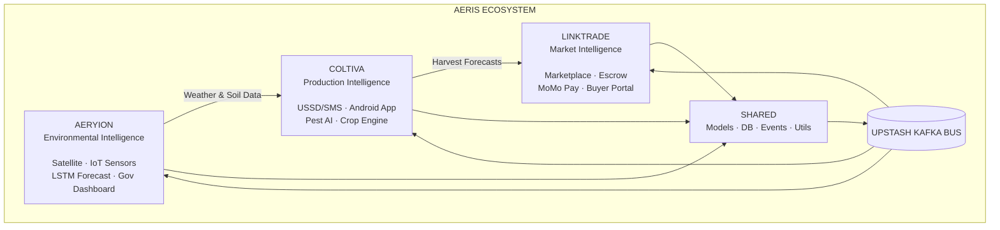

# AERIS Group — Integrated Agricultural Intelligence Infrastructure

[](https://github.com/aeris-group/aeris-monorepo/actions/workflows/ci.yml)

## Ecosystem Architecture

AERIS is a three-platform agricultural intelligence ecosystem designed for Uganda's Lango sub-region. Each platform operates as an independent domain service, communicating via an event-driven architecture (Upstash Kafka) while sharing foundational data models and utilities.



### Aeryion — Environmental Intelligence Platform

The data foundation of AERIS. Processes satellite imagery (Sentinel-2, Landsat, CHIRPS) via Google Earth Engine, runs LSTM rainfall forecasts, manages IoT weather stations, and serves a government-facing dashboard for MAAIF.

- **Tech:** Python FastAPI, Google Earth Engine, PostGIS, Supabase, TensorFlow
- **Key Events Published:** `WEATHER_ALERT`, `SOIL_REPORT_READY`
- **Consumers:** Coltiva, LinkTrade, Government Dashboard

### Coltiva — Production Intelligence Platform

The farmer-facing layer. Delivers crop recommendations, planting calendars, pest detection, and weather alerts to 120,000+ smallholder farmers via USSD (any phone, no internet) and a Flutter Android app for village agents.

- **Tech:** Python FastAPI, Africa's Talking USSD/SMS, Flutter 3, TensorFlow Lite, Firebase
- **Key Events Published:** `HARVEST_FORECAST`, `PEST_OUTBREAK_DETECTED`
- **Consumers:** LinkTrade, Aeryion

### LinkTrade — Market Intelligence Platform

The marketplace layer. Connects farmers to verified buyers with mobile-money escrow (MTN MoMo, Airtel Money), real-time price intelligence from free data sources, and logistics coordination.

- **Tech:** Next.js 16, Python FastAPI, MTN MoMo API, Airtel Money API, Supabase
- **Key Events Published:** `TRADE_COMPLETED`, `MARKET_PRICE_UPDATE`
- **Consumers:** Coltiva, Aeryion

---

## Repository Structure

```
aeris-monorepo/
├── .github/workflows/ci.yml
├── aeryion/
│   ├── backend/              FastAPI :8000
│   └── dashboard/            Next.js :3001
├── coltiva/
│   ├── backend/              FastAPI :8001
│   └── mobile/               Flutter 
├── linktrade/
│   ├── backend/              FastAPI :8002
│   └── web/                  Next.js :3000
├── shared/
│   ├── events/
│   ├── models/
│   ├── db/
│   └── utils/
├── docker-compose.yml
├── pnpm-workspace.yaml
├── package.json
└── README.md
```

## Prerequisites

| Tool | Version | Purpose |
|------|---------|---------|
| Node.js | ≥ 20.x | Next.js frontends |
| pnpm | ≥ 9.x | Package manager |
| Python | ≥ 3.11 | FastAPI backends |
| Docker | Latest | Local infrastructure |
| Flutter | ≥ 3.x | Coltiva mobile|

## Setup

### 1. Clone and install frontend dependencies

```bash
git clone https://github.com/aeris-group/aeris-monorepo.git
cd aeris-monorepo
pnpm install
```

### 2. Set up environment files

```bash
cp linktrade/web/.env.example linktrade/web/.env.local
cp aeryion/dashboard/.env.example aeryion/dashboard/.env.local
cp linktrade/backend/.env.example linktrade/backend/.env
cp aeryion/backend/.env.example aeryion/backend/.env
cp coltiva/backend/.env.example coltiva/backend/.env
```

### 3. Start infrastructure (PostgreSQL + Redis)

```bash
docker compose up postgres redis -d
```

### 4. Set up Python backends

Each backend has its own virtual environment:

```bash
cd aeryion/backend
python3 -m venv venv && source venv/bin/activate
pip install -r requirements.txt
uvicorn app.main:app --reload --port 8000
```

```bash
cd coltiva/backend
python3 -m venv venv && source venv/bin/activate
pip install -r requirements.txt
uvicorn app.main:app --reload --port 8001
```

```bash
cd linktrade/backend
python3 -m venv venv && source venv/bin/activate
pip install -r requirements.txt
uvicorn app.main:app --reload --port 8002
```

### 5. Start frontends

From the project root:

```bash
pnpm dev:linktrade    # LinkTrade web → http://localhost:3000
pnpm dev:dashboard    # Aeryion dashboard → http://localhost:3001
pnpm dev:all          # Both frontends in parallel
```

### 6. Verify connectivity

```bash
curl http://localhost:3000/api/health
curl http://localhost:3001/api/health
curl http://localhost:8000/api/v1/health
curl http://localhost:8001/api/v1/health
curl http://localhost:8002/api/v1/health
```

### Full stack with Docker

```bash
docker compose up -d
```

| Service | URL |
|---------|-----|
| LinkTrade Web | http://localhost:3000 |
| Aeryion Dashboard | http://localhost:3001 |
| Aeryion API | http://localhost:8000/docs |
| Coltiva API | http://localhost:8001/docs |
| LinkTrade API | http://localhost:8002/docs |
| PostgreSQL | localhost:5432 |
| Redis | localhost:6379 |

---

## Deployment

### Frontends (Vercel)

Each frontend is deployed as a **separate Vercel project** from the same GitHub repo. Import the repo twice, each time pointing to a different root directory. Each project gets its own `*.vercel.app` URL and only rebuilds when its own files change.

#### LinkTrade Web

1. Go to [vercel.com/new](https://vercel.com/new) → Import this repository
2. Set **Root Directory** to `linktrade/web`
3. Add environment variables from `linktrade/web/.env.example`
4. Set `NEXT_PUBLIC_LINKTRADE_API_URL` to your deployed LinkTrade backend URL
5. Deploy

#### Aeryion Dashboard

1. Go to [vercel.com/new](https://vercel.com/new) → Import the **same repository** again
2. Set **Root Directory** to `aeryion/dashboard`
3. Add environment variables from `aeryion/dashboard/.env.example`
4. Set `NEXT_PUBLIC_AERYION_API_URL` to your deployed Aeryion backend URL
5. Deploy

Each project's `vercel.json` includes an `ignoreCommand` that skips rebuilds when only the other frontend or backend files changed — saving build minutes on the free tier.

API rewrites are handled by `next.config.ts` using the `NEXT_PUBLIC_*_API_URL` environment variables set in each Vercel project's settings.

### Backends (Docker)

The FastAPI backends can be deployed to a container:

```bash
docker build -t aeryion-api ./aeryion/backend
docker build -t coltiva-api ./coltiva/backend
docker build -t linktrade-api ./linktrade/backend
```
